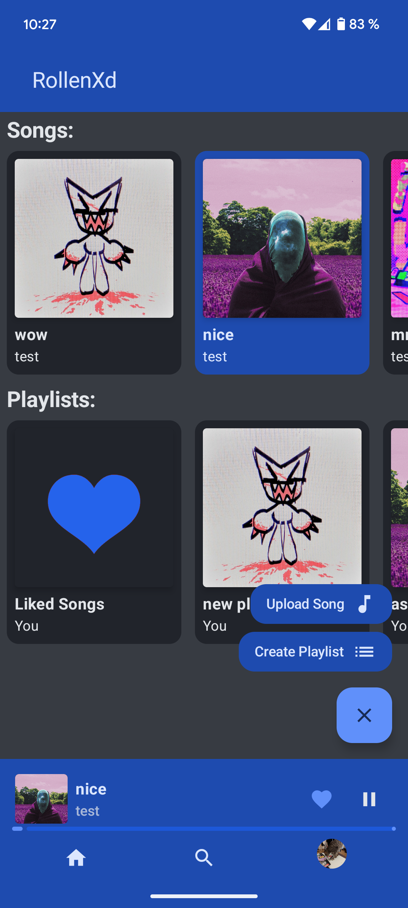

# RollenXD - Music Sharing and Listening Platform

RollenXD is a full-stack music sharing and listening platform. In the Android application users can listen to and like songs, playlists, and edit their profile, but in the Web application they can upload songs, create playlists, search for songs/playlists by their name or by username and comment on songs. The Android application is developed using Jetpack Compose with Hilt, Retrofit, ExoPlayer3 and Coil. The Web application's frontend is built with React.js (Vite), while the backend is developed using Spring Boot with PostgreSQL as the database.

## Table of Contents
- [Technologies Used](#technologies-used)
- [Getting Started](#getting-started)
  - [Prerequisites](#prerequisites)
  - [Backend Setup](#backend-setup)
  - [Network Setup](#network-setup)
- [Quick Start](#quick-start)
- [Screenshots](#screenshots)
- [Planned Features](#planned-features)


---

## Technologies Used
- 
- 
- 
- 
- 
- 

---

## Getting Started

### Prerequisites

- [Docker](https://www.docker.com/)
- [Android Studio](https://developer.android.com/studio) 
- Android Device or Virtual Device with SKD 35 of Android or higher

---

### Backend Setup

### 1. Clone the Repository containing the backend:
```sh

git clone https://github.com/bothbartos/rollenXd.git
cd RollenXD

```

### 2. Running with Docker
#### 1. Create a .env file in the base package, using the .env_example for template
#### 2. Build and run the containers:

```sh

docker-compose up --build

```
To stop the running containers:
```sh

docker-compose down

```
### 3. Register and add a few songs and playlists through website (http://localhost)

---

### Network Setup
### MacOS/Linux setup:
#### 1. Run this command in the terminal:
```sh

ifconfig

```
#### Or if it's not available:
```sh

ip addr

```
#### 2. Look for the inet entry under your active network interface (often eth0, en0, or wlan0) and copy it.
Example output:
```text

inet 192.168.1.42  netmask 255.255.255.0  broadcast 192.168.1.255

```
Your IP address is the number after inet (e.g., 192.168.1.42).

- Continue [Here](#network-detail-setup)

---

### Windows:

#### 1. Run this command in the Command Prompt:
```text

ipconfig

```
#### 2. Look for the IPv4 Address under your active adapter (e.g., “Ethernet adapter” or “Wireless LAN adapter”) and copy it.
Example output:
```text

IPv4 Address. . . . . . . . . . . : 192.168.1.100

```
Your IP address is the number after “IPv4 Address” (e.g., 192.168.1.100).

- Continue [Here](#network-detail-setup)

---

### Network Detail Setup:

#### 1. Create a bartosboth.properties file in the base package of the Android application (use bartosboth_example.properties as template) and paste the IP address there.
#### 2. Create a network_security_config.xml file in the Android application's app/src/main/res/xml folder (use the network_security_config_example.xml as template) and paste the IP address there.

## Quick Start 

1. Register or log in through the web interface.
2. Upload songs or playlists.
3. Build and run the Android app and enjoy your music:
   - [Virtual Device Setup](https://developer.android.com/studio/run/emulator)
   - [Local Device Setup](https://developer.android.com/studio/run/device)
  

---

## Screenshots:





## Planned Features:
 - Upload songs and create playlists
 - Search for songs and playlists
 - Comment on songs
